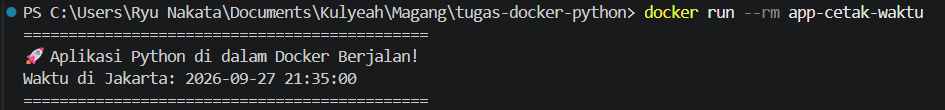

# Proyek Dasar Docker: Python Script

Proyek ini bertujuan untuk mendemonstrasikan konsep dasar containerization, isolasi aplikasi, dan pembuatan instruksi otomatisasi menggunakan Docker.

## Prasyarat
- Docker telah terinstal dan berjalan (Docker Desktop / Docker Engine).

## Cara Build Docker Image
Buka terminal di direktori proyek ini, lalu jalankan perintah berikut:
`docker build -t app-cetak-waktu .`
*Keterangan: `-t app-cetak-waktu` digunakan untuk memberikan nama (tag) pada image yang dibuild.*

## Cara Menjalankan Docker Container
Setelah proses build selesai tanpa error, jalankan container dengan perintah:
`
docker run --rm app-cetak-waktu
\`
*Keterangan: Flag `--rm` memastikan container akan langsung dihapus secara otomatis dari sistem setelah script selesai dieksekusi, sehingga menghemat ruang penyimpanan.*

## Tangkapan Layar Hasil Eksekusi
*(Unggah screenshot terminal Anda ke GitHub dan masukkan link gambarnya di bawah ini)*

![Screenshot Eksekusi Terminal]
